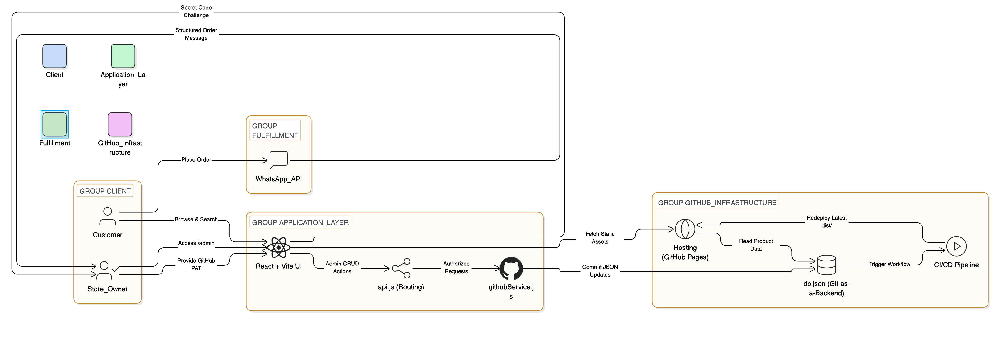
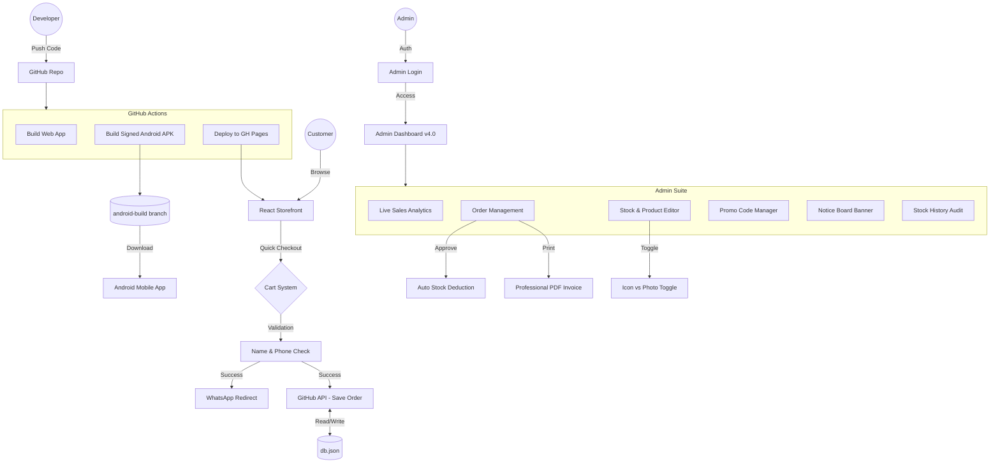

# Jamui Super Mart 🛒

[](https://jamuisupermart.in)
[](https://bhardwajkaran054.github.io/jamui/)
[](https://react.dev)
[](https://vitejs.dev)
[](https://tailwindcss.com)
[](https://github.com/bhardwajkaran054/jamui/raw/android-build/jamui-supermart.apk)

A professional, enterprise-grade grocery store web application for **Jamui Super Mart** in Bihar, India. This project showcases a cutting-edge **"Serverless Git-as-a-Backend"** architecture, providing full dynamic functionality without traditional backend overhead.

---

## 📱 Mobile App (Android)

Experience Jamui Super Mart as a native application on your Android device.

[**📥 Download Latest APK (Direct)**](https://github.com/bhardwajkaran054/jamui/raw/android-build/jamui-supermart.apk)

*Note: You may need to enable "Install from Unknown Sources" in your Android settings to install this APK.*

---

## 🚀 Key Features

- **Full-Stack on GitHub**: Operates without a traditional server or external database by leveraging the GitHub API as a data persistence layer.
- **Dynamic Inventory Management**: A private administrative suite for real-time CRUD (Create, Read, Update, Delete) operations on the product catalog.
- **Intelligent Stock Tracking**: Real-time inventory synchronization that automatically decrements stock levels when orders are placed.
- **WhatsApp Integration**: High-conversion order flow that generates structured, professional summaries for direct customer-to-owner communication.
- **Modern Glassmorphism UI**: High-end design aesthetics using Tailwind CSS, featuring smooth micro-interactions, responsive layouts, and a mobile-first philosophy.
- **Blazing Fast Performance**: Instant search, category filtering, and optimized asset delivery via GitHub's Global CDN.

---

## 🛠️ Technical Architecture

 Arch 




### 1. Git-as-a-Backend (GaaB)
The core innovation of this project is its serverless data management. Unlike standard applications that require a running database server (like PostgreSQL or MongoDB), this app uses the GitHub repository itself as a structured database.
- **Data Store**: [db.json](public/db.json) acts as the centralized source of truth.
- **Persistence**: Administrative changes are committed directly to the repository via the GitHub REST API.
- **Versioning**: Every inventory change creates a historical audit trail within the Git log.

### 2. Modern Frontend Stack
- **React 18**: High-performance UI rendering with efficient state management.
- **Vite 5**: Next-generation frontend tooling for near-instant hot module replacement and optimized production builds.
- **Tailwind CSS**: A utility-first CSS framework for rapid UI development and consistent design tokens.
- **Lucide React**: Lightweight, pixel-perfect iconography.

### 3. Security Implementation
The application implements a multi-layered security model to protect administrative functions:
- **Private Entry Points**: Hidden administrative navigation and access controls.
- **Base64 Challenges**: A preliminary verification layer to prevent automated scanning.
- **PAT Authorization**: Leverages GitHub Personal Access Tokens (PAT) for authenticated write operations, ensuring only authorized owners can modify data.
- **Environment Parity**: Seamless transition between development and production environments via unified API routing.

---

## 📂 Project Structure

```bash
jamui/
├── .github/workflows/    # Automated CI/CD Deployment pipeline
├── public/
│   ├── db.json           # Centralized Database (Flat-file storage)
│   └── CNAME             # Custom Domain configuration
├── src/
│   ├── components/       # Modular UI Components (Admin, UI, Layout)
│   ├── services/         # GitHub API Integration Layer (githubService.js)
│   ├── api.js            # Unified Data Routing & Endpoint Management
│   ├── App.jsx           # Core Application State & Logic
│   └── main.jsx          # Application entry point
├── vite.config.js        # Build system and plugin configuration
└── tailwind.config.js    # Design system and theme configuration
```

---

## 📱 Native Android App

This project is equipped with **Capacitor** to build a native Android application from the web codebase.

### 1. Prerequisites
- **Android Studio** installed locally.
- **Java 17** (Zulu or similar).

### 2. Local Development
To sync changes from the web app to the Android project:
```bash
npm run build
npm run cap-sync
npx cap open android
```

### 3. App Icons & Splash Screens
1. Place a high-resolution icon (`icon.png`, min 1024x1024px) and splash screen (`splash.png`, min 2732x2732px) in the `assets/` folder.
2. Run the generation script:
   ```bash
   npm run generate-assets
   ```

### 4. Automated APK Building (GitHub Actions)
Every push to `main` triggers an automated build. You can find the **Debug APK** in the "Actions" tab of your repository.

#### Important for Forks:
To enable the **Direct Download APK** to work on your fork, you must:
1. Go to your repository **Settings** > **Actions** > **General**.
2. Under **Workflow permissions**, select **"Read and write permissions"**.
3. Click **Save**.

#### To enable **Signed Release APKs**:
Add the following [GitHub Secrets](https://github.com/bhardwajkaran054/jamui/settings/secrets/actions) to your repository:
- `KEYSTORE_FILE`: Your `.jks` or `.keystore` file encoded in **Base64**.
- `KEYSTORE_PASSWORD`: The password for your keystore.
- `KEY_ALIAS`: The alias of your signing key.
- `KEY_PASSWORD`: The password for your signing key.

---

## 🤝 Contributors

- **[Karan Bhardwaj](https://github.com/bhardwajkaran054)** — Developer & Owner
- **[Monesh Ram](https://github.com/WhoisMonesh)** — Full-Stack Architect & Optimization

---

## 📄 License

This project is open-source and available under the MIT License.

Built with ❤️ for Jamui Super Mart.
